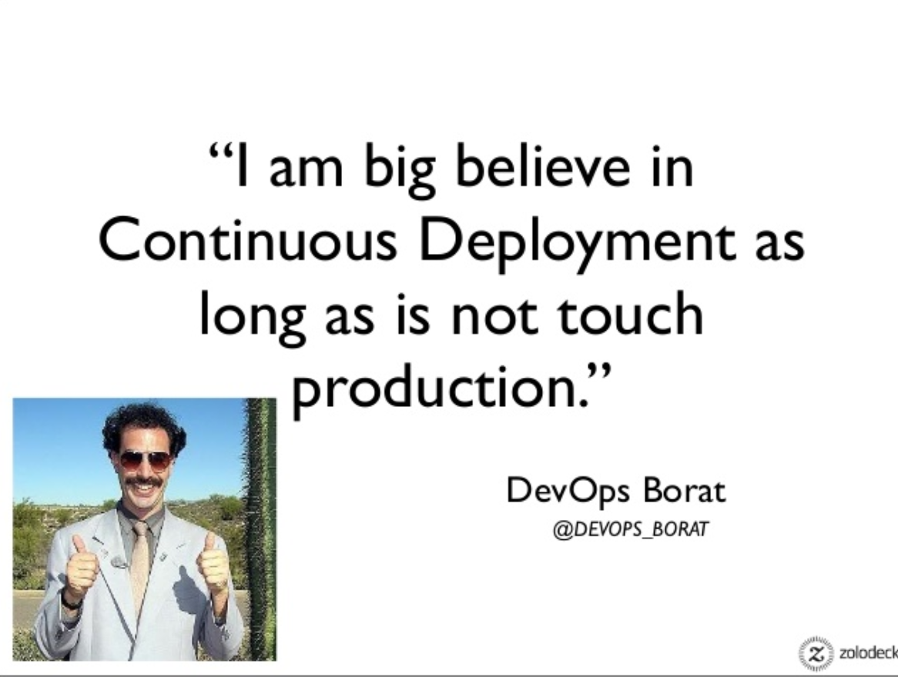
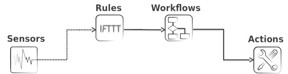

##Auto-magicking the humans out of things

###David Gee
###ipengineer.net
###@VTEP42

---
## Introduction

Currently working for Extreme Networks post Brocade acquisition and specialise in automation, event-driven automation and network orchestration.

Blogger for half a decade, Tech Field Day delegate, podcaster with Ivan Pepelnjak, software developer and network engineer and lover.

I also love the sound of my own voice and like to share stuff using it.

---
## Automagicking The Humans Out Of Things: 15 minute hoedown!

---
## Automagicking The Humans Out Of Things

I don't want anyone to lose their job.

You have more important things to do than chase your tail.

As a measure of the impact, I expect to see rudimentary tasks minimised.

---
## Automagicking The Humans Out Of Things

I don't want anyone to lose their job.

You have more important things to do than chase your tail.

As a measure of the impact, I expect to see rudimentary tasks minimised.

STOP CREATING VLANS BY HAND!

---
## Automagicking The Humans Out Of Things

Things to share. Any guesses?

1.
2.

---
## Automagicking The Humans Out Of Things

Things to share. Any guesses?

1.  Be a developer
2.

---
## Automagicking The Humans Out Of Things

Things to share

1.  ~~Be a developer~~
2.

---
## Automagicking The Humans Out Of Things

Things to share

1.  ~~Be a developer~~
2.  Use common sense and logic

---
## Guide to Automagicking Humans Away

Automation, especially event driven, is a data collection, analysis and transformation problem.

We take an input, make a decision and do something with it.

---
## Guide to Automagicking Humans Away

The Path:
- Intimately understand the task at hand.
- Create an engineering flow chart.
- Digitise the flow chart on a platform.

Digitised flow charts allow re-use (aka `rinse and repeat`)

---
## *How is the automation kicked off?*

---
## Event Driven Automation

Currently, users of automation kick off automation on demand.

Years of `oops` and `ahhh sh*t` have introduced safety nets into organisations globally.

---
## Event Driven Automation

No single answer, but a selection of signals, signal humans to do things:

- Internal Customer Signal
- External Customer Signal
- Network Event Signals (Syslog / NETCONF / MDT etc)
- Date/Time

...but why do this stuff manually?

---

---
## The Right Way

Challenge the risk with value.

Pick something that when FULLY automated delivers REAL value instead of a perverts wet dream.
Harsh words, but too much of this stuff fails because of lack of value.

Start simple, call out the risk transparently, show the value.

---
## A Starting Point?

Examples

- Consume a webhook from a security device to quarantine a user and disable accounts
- Consume a syslog feed from a network device to create a trouble ticket on *down* events
- Consume MDT UDP data for usage correlation and threshold alerting

---
## A Starting Point?

Use mechanical sympathy: In other words, lay out your flow chart with empathy to the tools you use.

Here's StackStorm's pipeline:

---
## A Starting Point?

Start small, think big.

Focus; do not use a shotgun wanting to achieve surgical accuracy.

Be realistic, truthful and honest.Humans make mistakes, sometimes, automation can fail.

---

## Q&A

---
## Simple Demo!

Take a Syslog feed from a data-centre device and create a trouble ticket when a certain pattern is matched.

Syslog -> Analyse for patterns -> Create Ticket
*laid over*
Sensor -> Rule -> Action

*Mechnical Sympathy In Action!*

---
## Live Demo!!!...!!!!!..!

---
## Close

Be brave and do not think glory comes for free. It does not.

HOWEVER...

You can install StackStorm for free.

You can install the syslog `Ghost2logger` and `Zendesk` packs for free.

Time: 30 minutes for working demo. What have you got to lose?

---
## Thank You
